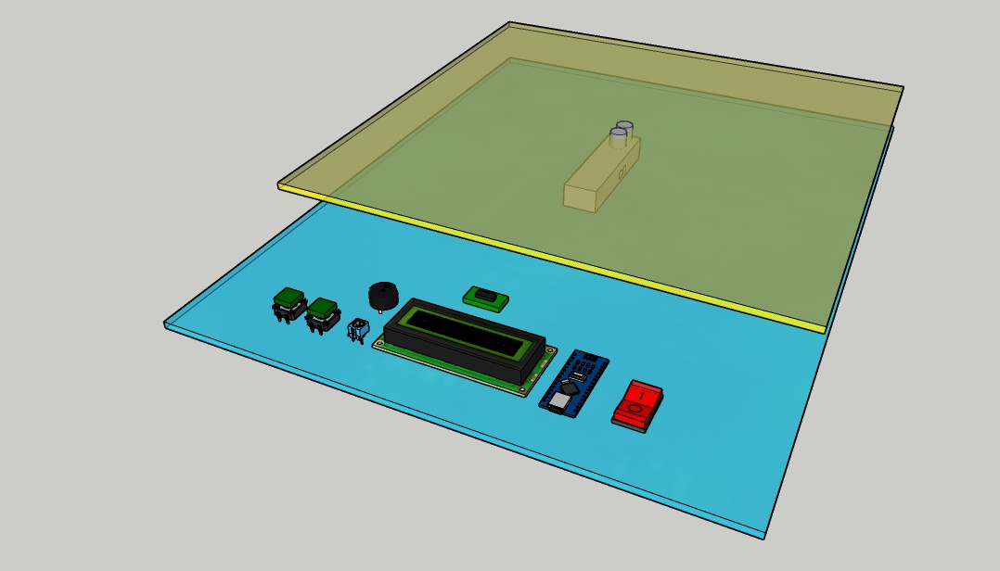
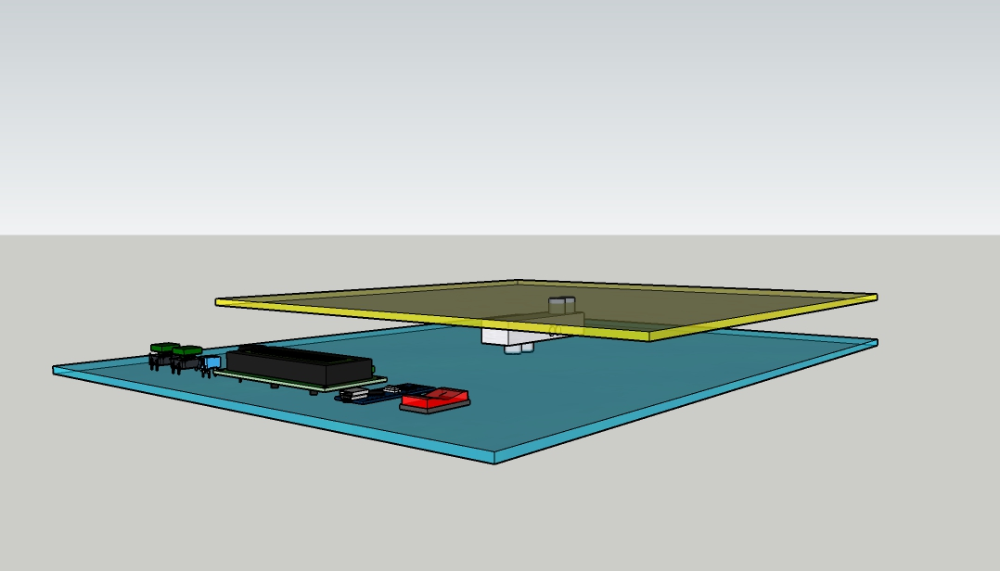
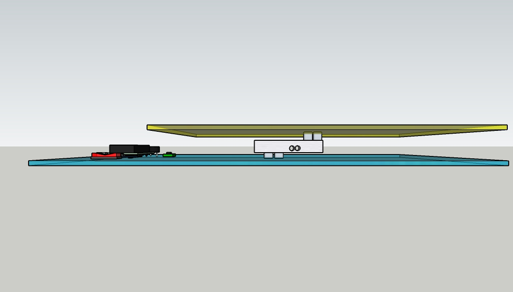
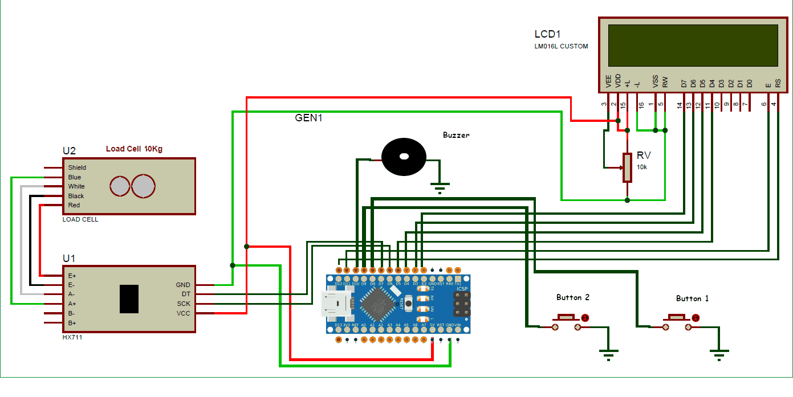
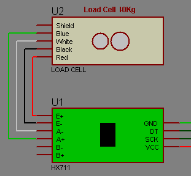
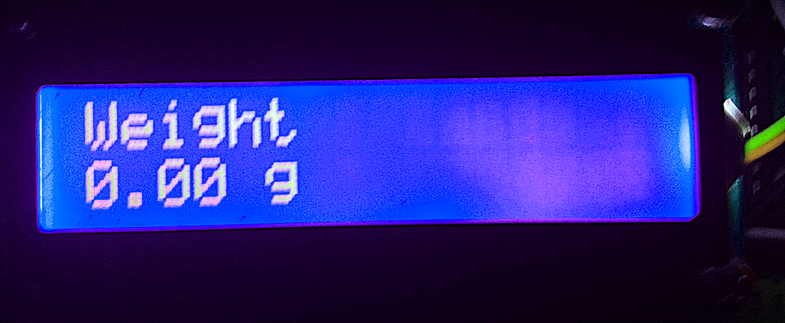
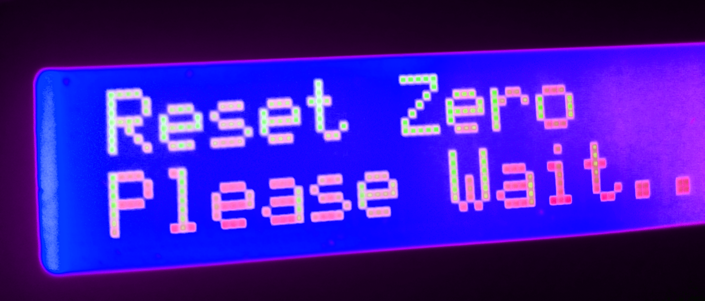
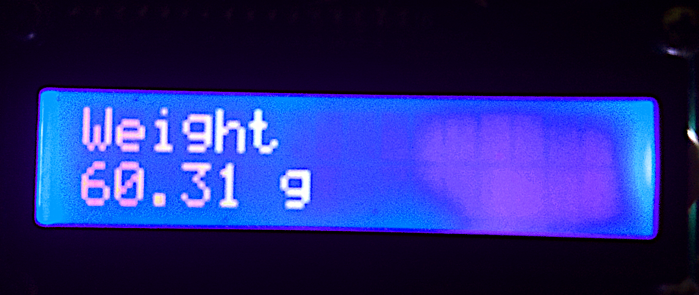
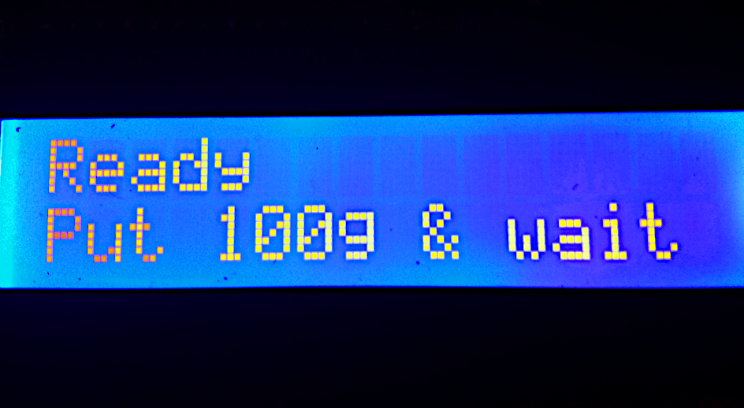

Weighing machine by using Arduino
=================================

Software Dependencies:
----------------------

Must be installed HX711 library for Arduino IDE.

Required Components:
---------------------------------

- Arduino Nano
- Load cell 10kg (Load cell comes in various ranges like 5kg, 10kg, 100kg and more)
- HX711 Load cell Amplifier Module
- 16x2 LCD
- Connecting wires
- Variable resistor 10kOm
- Buzzer
- 2 push Buttons
- Nuts, bolts, frame and base

Fixing Load Cell with Platform and Base:
----------------------------------------

This step is optional and you can directly put the weights on the Load cell without Platform and can simply clamp it without fixing it with any base, but it’s better to attach a platform for putting the large things on it and fix it on a Base so that it stand still.

Circuit Explanation:
--------------------

### LCD:
 * LCD RS pin to digital pin 12
 * LCD Enable pin to digital pin 11
 * LCD D4 pin to digital pin 5
 * LCD D5 pin to digital pin 4
 * LCD D6 pin to digital pin 3
 * LCD D7 pin to digital pin 2
 * LCD R/W pin to ground
 * LCD VSS pin to ground
 * LCD VCC(VDD) pin to +5V
 * LCD A pin to +5V
 * LCD K pin to ground
 * 10K resistor:
   * ends to +5V and ground
   * wiper to LCD VO pin (pin 3)
### HX711:
 * DOUT (DT) pin to digital pin 7
 * CLK (SCK) pin to digital pin 6
 * VCC pin to +5V
 * GND pin to ground
### Buzzer to digital pin 10 and ground
### Button1 zero calibration to digital pin 8 and ground
### Button2 weight calibration to digital pin 9 and ground
### Load cell connections with HX711 module:
 * RED Wire is connected to E+
 * BLACK Wire is connected to E-
 * WHITE Wire is connected to A-
 * GREEN/BLUE Wire is connected to A+ 
 

 
Working Explanation:
--------------------

Working of this Arduino Weight Measurement project is easy. Before going into details, first we have to calibrate this system for measuring correct weight.
### Reset Zero

When user will power it up then system will automatically start reset zero. And if user wants to reset zero it manually then press the push Button1. User can place an empty container on the scale, press the push Button1 to reset the readings to 0, fill the container and get the weight of the content.

### Calibration
For calibration, press the push Button2 wait for LCD indication for putting 100 gram over the load cell as shown in below picture. When LCD will show “put 100g” then put the 100g weight over the load cell and wait. After some seconds calibration process will be finished. After calibration user may put any weight (max 10kg) over the load cell and can get the value over LCD in grams.

